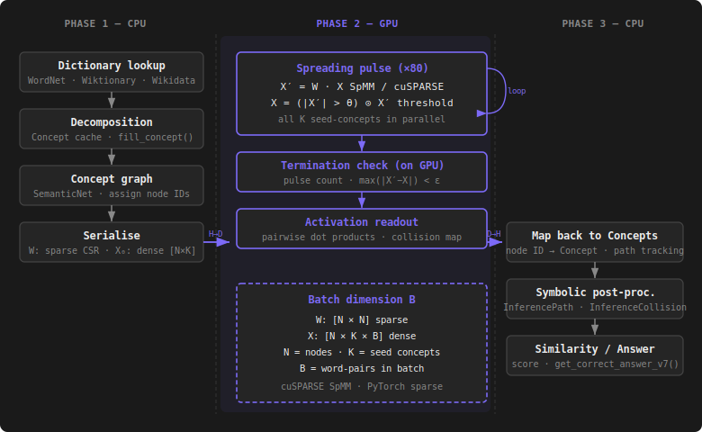

# MarkerPassingAlgorithm

A generalised, framework-agnostic implementation of the **Marker Passing** algorithm
based on [Crestani (1997)](https://doi.org/10.1023/A:1006569829653).

Marker Passing extends classical Spreading Activation by replacing the single
floating-point *zorch* with an arbitrary **Marker** object. Every node can
inspect, transform, and forward markers along its links, making it possible to
encode symbolic information (provenance, path history, typed activation) alongside
numeric values.

```
@InProceedings{Faehndrich2018,
  author    = {Fähndrich, Johannes and Weber, Sabine and Kanthak, Hannes},
  title     = {A Marker Passing Approach to Winograd Schemas},
  booktitle = {Semantic Technology},
  year      = {2018},
  publisher = {Springer International Publishing},
  pages     = {165--181},
  doi       = {10.1007/978-3-030-04284-4_11}
}
```

---

## Requirements

| | CPU (`python` branch) | GPU (`python_gpu` branch) |
|---|---|---|
| Python | 3.9+ | 3.9+ |
| Dependencies | none (pure stdlib) | `torch` (PyTorch ≥ 2.0) |
| CUDA | — | optional (falls back to CPU tensors) |

```bash
# GPU branch only
pip install torch
# with CUDA (example for CUDA 12.1):
pip install torch --index-url https://download.pytorch.org/whl/cu121
```

## Installation

```bash
git clone https://github.com/Datenverlust/MarkerPassingAlgorithm.git
cd MarkerPassingAlgorithm
git checkout python_gpu

# install as an editable package (optional)
pip install -e .
pip install torch
```

---

## Package structure

```
marker_passing/
├── __init__.py                     # re-exports all public classes
├── marker.py                       # Marker          — abstract base for marker objects
├── link.py                         # Link             — abstract directed edge
├── node.py                         # Node             — abstract graph vertex
├── spreading_step.py               # SpreadingStep    — one link traversal + its markers
├── spreaded_markers.py             # SpreadedMarkers  — target-node → steps buffer
├── in_function.py                  # InFunction       — hook: markers arriving at a node
├── out_function.py                 # OutFunction      — hook: markers leaving a node
├── select_firing_nodes_function.py # SelectFiringNodesFunction — which nodes fire each pulse
├── processing_step.py              # ProcessingStep   — pre/post-processing hook
├── termination_condition.py        # TerminationCondition — when to stop
└── spreading_algorithm.py          # SpreadingAlgorithm — main pulse loop
```

---

## Core concepts

### Marker

The unit of information that travels through the graph. Subclass `Marker` to
attach whatever payload makes sense for your application — a float, a path
history, a typed activation value.

```python
from marker_passing import Marker

class DoubleMarker(Marker):
    def __init__(self, value: float) -> None:
        self.value = value
```

### Link

A directed edge between two nodes. Subclass `Link` and implement `source`/`target`
as properties.

```python
from marker_passing import Link

class WeightedLink(Link):
    def __init__(self, source, target, weight: float = 1.0):
        self._source = source
        self._target = target
        self.weight = weight

    @property
    def source(self): return self._source
    @source.setter
    def source(self, v): self._source = v

    @property
    def target(self): return self._target
    @target.setter
    def target(self, v): self._target = v
```

### Node

A vertex in the graph. Subclass `Node` and implement `get_links()`,
`get_markers()`, and `check_thresholds()`.

```python
from marker_passing import Node

class SimpleNode(Node):
    def __init__(self, name: str):
        self.name = name
        self._links = []
        self._markers = []
        self.activation = 0.0

    def get_links(self): return self._links
    def get_markers(self): return self._markers

    def check_thresholds(self, marker_classes=None) -> bool:
        return self.activation > 0.0

    def __repr__(self): return f"Node({self.name})"
```

### SpreadingStep

Carries markers across one link during a single pulse. `in_direction=True`
means the step travels from `link.source` → `link.target`; `False` reverses it.

```python
from marker_passing import SpreadingStep

step = SpreadingStep()
step.link = my_link
step.in_direction = True
step.markings = [DoubleMarker(0.5)]
target = step.get_target_node()   # resolves to link.target
```

### OutFunction / InFunction

| Hook | Called on | Returns |
|---|---|---|
| `OutFunction.compute(node)` | every firing node | `Collection[SpreadingStep]` |
| `InFunction.compute(steps, node)` | every node receiving steps | `None` (mutates node) |

### SelectFiringNodesFunction

Filters `active_nodes` down to the subset that fires in a given pulse.

### ProcessingStep / TerminationCondition

`ProcessingStep.execute()` runs before or after each pulse (counter, logger, …).
`TerminationCondition.compute()` returns `True` when the algorithm should stop.
Both are often implemented by the same class.

### SpreadingAlgorithm

The main orchestrator. Wire up the strategy objects and call `execute()`.

| Property | Type | Role |
|---|---|---|
| `active_nodes` | `List[Node]` | All nodes currently in play |
| `firing_nodes` | `List[Node]` | Nodes selected to fire this pulse (read-only after each pulse) |
| `in_function` | `InFunction` | Absorption hook |
| `out_function` | `OutFunction` | Emission hook |
| `select_firing_nodes` | `SelectFiringNodesFunction` | Firing filter |
| `termination_condition` | `TerminationCondition` | Stop condition |
| `preprocessing_steps` | `List[ProcessingStep]` | Run before each pulse |
| `postprocessing_steps` | `List[ProcessingStep]` | Run after each pulse |

---

## Algorithm flow

```
execute()
└── while not terminated:
    └── _pulse()
        ├── _preprocess()        — run preprocessing_steps
        ├── select               — SelectFiringNodesFunction picks firing nodes
        ├── _spread()            — OutFunction emits SpreadingSteps per firing node;
        │                          SpreadedMarkers groups them by target;
        │                          InFunction absorbs them at each target node;
        │                          target nodes are added to active_nodes
        ├── _postprocess()       — run postprocessing_steps
        └── _check_termination() — TerminationCondition decides whether to stop
```

---

## Usage examples

### Example 1 — Simple weighted activation

A minimal three-node chain `A → B → C` where activation halves on each hop.

```python
from marker_passing import (
    Marker, Link, Node, SpreadingAlgorithm,
    InFunction, OutFunction, SelectFiringNodesFunction,
    TerminationCondition, ProcessingStep, SpreadingStep,
)


class FloatMarker(Marker):
    def __init__(self, value: float):
        self.value = value


class WeightedLink(Link):
    def __init__(self, source, target, weight=1.0):
        self._source, self._target, self.weight = source, target, weight

    @property
    def source(self): return self._source
    @source.setter
    def source(self, v): self._source = v

    @property
    def target(self): return self._target
    @target.setter
    def target(self, v): self._target = v


class SimpleNode(Node):
    def __init__(self, name):
        self.name = name
        self._links, self._markers = [], []
        self.activation = 0.0

    def get_links(self): return self._links
    def get_markers(self): return self._markers
    def check_thresholds(self, mc=None): return self.activation > 0.0
    def __repr__(self): return f"Node({self.name}, act={self.activation:.3f})"


class WeightedOut(OutFunction):
    def compute(self, node):
        steps = []
        for link in node.get_links():
            for m in node.get_markers():
                if isinstance(m, FloatMarker):
                    s = SpreadingStep()
                    s.link = link
                    s.in_direction = True
                    s.markings = [FloatMarker(m.value * link.weight)]
                    steps.append(s)
        return steps


class SummingIn(InFunction):
    def compute(self, input_steps, node):
        for step in input_steps:
            for m in step.markings:
                if isinstance(m, FloatMarker):
                    node.activation += m.value
                    node.get_markers().append(m)


class AllNodes(SelectFiringNodesFunction):
    def compute(self, active_nodes): return active_nodes


class PulseLimit(ProcessingStep, TerminationCondition):
    def __init__(self, n): self._n, self._i = n, 0
    def execute(self): self._i += 1
    def compute(self): return self._i >= self._n


# Build graph
a, b, c = SimpleNode("A"), SimpleNode("B"), SimpleNode("C")
a.get_links().append(WeightedLink(a, b, weight=0.5))
b.get_links().append(WeightedLink(b, c, weight=0.5))

# Seed node A
a.get_markers().append(FloatMarker(1.0))
a.activation = 1.0

# Wire algorithm
stop = PulseLimit(5)
algo = SpreadingAlgorithm()
algo.active_nodes = [a, b, c]
algo.out_function = WeightedOut()
algo.in_function = SummingIn()
algo.select_firing_nodes = AllNodes()
algo.termination_condition = stop
algo.preprocessing_steps = [stop]

algo.execute()

print(a)  # Node(A, act=1.000)
print(b)  # Node(B, act=0.500)
print(c)  # Node(C, act=0.250)
```

---

### Example 2 — Pulse counter + threshold selection

Only fire nodes whose activation exceeds a threshold. Stop after 10 pulses.

```python
THRESHOLD = 0.1

class ThresholdNode(SimpleNode):
    def check_thresholds(self, mc=None):
        return self.activation >= THRESHOLD


class AboveThreshold(SelectFiringNodesFunction):
    def compute(self, active_nodes):
        return [n for n in active_nodes if n.check_thresholds()]


stop = PulseLimit(10)
algo = SpreadingAlgorithm()
algo.active_nodes = [a, b, c]
algo.out_function = WeightedOut()
algo.in_function = SummingIn()
algo.select_firing_nodes = AboveThreshold()
algo.termination_condition = stop
algo.preprocessing_steps = [stop]

algo.execute()
```

---

### Example 3 — Bidirectional spreading

Pass `in_direction=False` on a step to traverse a link in reverse.

```python
class BidirectionalOut(OutFunction):
    def compute(self, node):
        steps = []
        for link in node.get_links():
            for m in node.get_markers():
                if isinstance(m, FloatMarker):
                    # forward
                    s1 = SpreadingStep()
                    s1.link, s1.in_direction = link, True
                    s1.markings = [FloatMarker(m.value * 0.5)]
                    # backward
                    s2 = SpreadingStep()
                    s2.link, s2.in_direction = link, False
                    s2.markings = [FloatMarker(m.value * 0.3)]
                    steps.extend([s1, s2])
        return steps
```

---

### Example 4 — Typed markers with origin tracking

Track where a marker started to detect when two markers from different origins
meet at the same node.

```python
class OriginMarker(Marker):
    def __init__(self, origin: str, value: float):
        self.origin = origin
        self.value = value


class CollisionIn(InFunction):
    def compute(self, input_steps, node):
        origins_seen = {m.origin for m in node.get_markers() if isinstance(m, OriginMarker)}
        for step in input_steps:
            for m in step.markings:
                if isinstance(m, OriginMarker):
                    if origins_seen and m.origin not in origins_seen:
                        print(f"Collision at {node}: markers from {origins_seen} and {m.origin}")
                    origins_seen.add(m.origin)
                    node.activation += m.value
                    node.get_markers().append(m)
```

---

## GPU acceleration (`marker_passing.gpu`)

The `python_gpu` branch adds a `marker_passing.gpu` subpackage that replaces the
object-oriented pulse loop with a **sparse matrix multiplication (SpMM)** kernel
running on the GPU via PyTorch / cuSPARSE.

### How it works



One complete spreading pulse — out-function, scatter, in-function — is equivalent to:

```
x' = W · x              (SpMM: cuSPARSE on GPU, or torch.mm on CPU)
x  = x' * (|x'| > θ)   (elementwise threshold mask)
```

Where **W** `[N × N]` is the sparse link-weight matrix and **x** `[N]` is the
activation vector.  The object-oriented `Node`, `Link`, `Marker` objects are only
needed to *build* W and x — the GPU loop never touches them.

### Constraints

| Supported | Not supported |
|---|---|
| Scalar-activation markers (float) | Symbolic markers (path history, typed labels) |
| Static graphs (topology fixed before execute) | Lazy graph expansion during spreading |
| `DoubleMarkerPassing`-style algorithms | `PathMarkerPassing` (abductive path tracking) |

### Package layout

```
marker_passing/gpu/
├── __init__.py
├── graph_serializer.py       # Node/Link graph → sparse COO weight matrix
└── cuda_spreading_algorithm.py  # GPU SpMM pulse loop + batched variant
```

### `GraphSerializer`

Converts a set of `Node` objects (and their outgoing `Link`s) into a COO sparse
matrix.  Link weights are extracted by duck-typing: it looks for a `.weight`
attribute, then `.get_weight()`, then falls back to `1.0`.

```python
from marker_passing.gpu import GraphSerializer

serializer = GraphSerializer(nodes=[a, b, c])
rows, cols, vals = serializer.build_coo()       # COO triplets
x0 = serializer.initial_activation_vector({a: 1.0})  # dense list[float]
```

### `CudaSpreadingAlgorithm` — single activation vector

Drop-in replacement for a scalar `SpreadingAlgorithm` where the marker is a float.

```python
from marker_passing.gpu import GraphSerializer, CudaSpreadingAlgorithm

# 1. Build the same Node/Link graph as usual
# (WeightedLink, SimpleNode — any concrete subclasses)
a, b, c = SimpleNode("A"), SimpleNode("B"), SimpleNode("C")
a.get_links().append(WeightedLink(a, b, weight=0.5))
b.get_links().append(WeightedLink(b, c, weight=0.5))

# 2. Serialise to GPU tensors
serializer = GraphSerializer([a, b, c])
algo = CudaSpreadingAlgorithm(
    serializer,
    threshold=0.05,
    max_pulses=80,
    device="cuda",   # or "cpu" for testing without a GPU
)

# 3. Set initial activation on seed nodes
algo.set_activation(a, 1.0)

# 4. Run — stays entirely on GPU until done
pulses = algo.execute()
print(f"Converged in {pulses} pulses")

# 5. Read results back to CPU
print(algo.get_activation(b))          # float
print(algo.get_all_activations())      # Dict[Node, float]
```

### `execute_batched` — K seed concepts in parallel

The primary GPU win: evaluate K independent activation vectors simultaneously in
one `[N × K]` SpMM per pulse, at almost no extra cost.

```python
# Compare cat vs dog and cat vs car in a single GPU pass
results = algo.execute_batched([
    {cat_node: 1.0, dog_node: 0.0},   # seed concept: cat
    {cat_node: 0.0, dog_node: 1.0},   # seed concept: dog
    {cat_node: 0.0, car_node: 1.0},   # seed concept: car
])

cat_activations = results[0]   # Dict[Node, float] for cat seed
dog_activations = results[1]
car_activations = results[2]
```

Throughput scales near-linearly with K.  For a dataset evaluation (e.g. all 353
WordSim-353 pairs at once, K = 706 seed concepts), this turns 353 sequential CPU
runs into a single GPU call.

### Device selection

```python
# Explicit CUDA device
algo = CudaSpreadingAlgorithm(serializer, device="cuda")

# Explicit CPU (for testing without a GPU — same code path, just slower)
algo = CudaSpreadingAlgorithm(serializer, device="cpu")

# Auto-detect (default): uses CUDA if available, otherwise CPU
algo = CudaSpreadingAlgorithm(serializer)
print(algo.device)   # "cuda:0" or "cpu"
```

### Convergence

`execute()` stops at `max_pulses` *or* when the maximum element-wise delta drops
below `convergence_eps` (default `1e-6`):

```python
algo = CudaSpreadingAlgorithm(
    serializer,
    max_pulses=200,
    convergence_eps=1e-8,
)
n = algo.execute()
print(f"Stopped after {n} pulses (max={algo.pulses_run})")
```

---

## API reference

### `SpreadingAlgorithm`

| Method / property | Description |
|---|---|
| `execute()` | Run the pulse loop until `termination_condition` fires |
| `active_nodes` | Get / set the list of nodes in play |
| `firing_nodes` | Nodes selected by `select_firing_nodes` in the last pulse |
| `in_function` | Set the `InFunction` strategy |
| `out_function` | Set the `OutFunction` strategy |
| `select_firing_nodes` | Set the `SelectFiringNodesFunction` strategy |
| `termination_condition` | Set the `TerminationCondition` strategy |
| `preprocessing_steps` | List of `ProcessingStep` run before each pulse |
| `postprocessing_steps` | List of `ProcessingStep` run after each pulse |

### `SpreadingStep`

| Property | Type | Description |
|---|---|---|
| `link` | `Link` | The edge being traversed |
| `in_direction` | `bool` | `True` → source→target, `False` → target→source |
| `markings` | `List[Marker]` | Markers carried by this step |
| `get_target_node()` | `Node` | Resolves the receiving node |

### `SpreadedMarkers`

Internal buffer used by `_spread()`. Groups `SpreadingStep`s by target node
before calling the `InFunction`.

| Method | Description |
|---|---|
| `add_all(steps)` | Accumulate a collection of steps |
| `get_target_nodes()` | All nodes that received at least one step |
| `get_input_for_target(node)` | All steps directed at `node` |

---

## Related projects

- **SemanticDecomposition** — builds weighted semantic concept graphs; uses this library for spreading activation
- **SemanticDecompositionExperiments** — NLP experiments (Winograd schemas, science QA, WSD) built on both

---

## License

[GPLv3](https://www.gnu.org/licenses/gpl-3.0.html)

Contact: datenverlust@gmail.com
